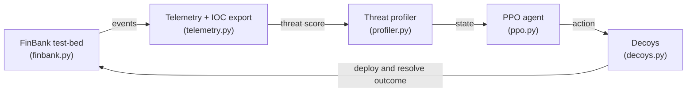

# AI-Driven Cyber Deception in FinTech: An Adaptive Defense Strategy

Reference implementation and companion repository for the peer-reviewed paper presented at the
**6th International Conference on AI Research (ICAIR 2025)**.

> **Isaac Ojeh, Xavier Palmer, Lucas Potter** (BiosView Labs)
> *Proceedings of the 6th International Conference on AI Research (ICAIR 2025)*, Vol. 6 No. 1.
> Academic Conferences International. Published 2025-12-04.
> DOI: [10.34190/icair.5.1.4365](https://doi.org/10.34190/icair.5.1.4365)

This repo contains a runnable implementation of the **Adaptive Deception Defense Framework
(ADDF)**: the FinBank test-bed, telemetry/IOC capture, a recurrent threat profiler, a PPO
deception agent, and the decoy layer, wired into the paper's closed loop. The default code path
runs on **Python + numpy alone** (`python -m addf.simulate`) and reproduces the *shape* of the
paper's evaluation; PyTorch, stable-baselines3 and Flask are optional upgrades.

## Abstract

FinTech platforms clear high-value transactions in milliseconds, making them lucrative targets
for adversaries who increasingly weaponize artificial intelligence. Once an attacker bypasses the
perimeter — via credential stuffing, supply-chain malware, or deep-fake social engineering —
traditional defenses often alert too late to prevent loss. We present an **Adaptive Deception
Defense Framework (ADDF)** that intertwines AI-orchestrated honeypots, honeytokens and decoy
micro-services within everyday banking and payment workflows. A recurrent-neural threat profiler
classifies live attacker behavior; a Proximal-Policy-Optimization agent then selects actions such
as spawning a shadow login API, cloning a database or injecting synthetic ledgers, thereby
misdirecting intruders while harvesting telemetry. In a controlled "FinBank" test-bed featuring a
vulnerable Flask-and-MySQL stack, ADDF shortened mean time-to-detect from 3 min 42 s to 29 s,
increased attacker dwell-time inside decoys to 12 min 18 s, and prevented all real data
exfiltration across ten attack trials. False-positive alerts remained below 1% per run, and added
resource use averaged 14% CPU/RAM on mid-range servers. The framework also produced high-fidelity
indicators of compromise that would have been unavailable under baseline controls. These findings
indicate that AI-driven cyber deception can transform FinTech security from passive monitoring
into proactive engagement, mitigating breach impact while supplying rich threat intelligence.

**Keywords:** AI-driven, deception, ADDF, honeypots, machine learning, adaptive, proactive
defense, FinTech.

## Architecture

The closed loop, mapped to the modules in [`src/addf/`](src/addf). `orchestrator.py` drives the
loop and `env.py` defines the agent's MDP:



- **Threat profiler** (`profiler.py`) — default is an Echo-State reservoir (fixed random
  recurrent weights + trained read-out): a genuine recurrent neural model in pure numpy. Swap in
  a trained **GRU** with `--profiler torch`.
- **PPO agent** (`ppo.py`) — a compact clipped-objective PPO with GAE and an annealed entropy
  bonus, learning when and how to deceive. A stable-baselines3 path is available via the `rl` extra.
- **Decoys** (`decoys.py`) — no-op, honeytoken, shadow login API, database clone, synthetic
  ledger, isolate; each with misdirection probability, exfil-blocking, intel yield and cost.
- **Attacker simulator** (`attacker.py`) — synthetic kill-chain behaviour (recon → credential
  stuffing → access → lateral movement → discovery → exfiltration). This is a *behaviour
  generator for evaluating the defence*, not an exploit toolkit.

## Results

**This reference simulation** (`python -m addf.simulate`, seed 7, 10 trials/condition):

| Metric | Baseline (passive monitoring) | **ADDF** |
|---|---|---|
| Detection rate | 100% | 100% |
| Mean time-to-detect | 3m 00s | **1m 00s** |
| Mean attacker dwell in decoys | 0s | **1m 42s** |
| Exfiltration prevented | 0% | **100%** |
| False-positive rate | 0.0% | **0.0%** |
| Resource overhead | 0% | **9.6%** |
| Unique IOCs harvested | — | **13** |

**The original paper**, on its Flask-and-MySQL FinBank test-bed, reports MTTD 3m 42s → 29s,
attacker dwell 12m 18s, all exfiltration prevented across ten trials, <1% false positives, and
~14% CPU/RAM overhead. The figures above come from *this* synthetic reference simulation and
reproduce the same qualitative result — ADDF detects far sooner, holds attackers in decoys,
prevents exfiltration, and harvests threat intelligence at modest overhead — not the paper's exact
numbers.

## Install and run

```bash
pip install -e .            # core (numpy only)
python -m addf.simulate     # train profiler + PPO agent, evaluate baseline vs ADDF (~5s)
```

Useful flags:

```bash
python -m addf.simulate --trials 20        # more trials per condition
python -m addf.simulate --profiler torch   # GRU profiler (needs the torch extra)
python -m addf.simulate --quiet --no-write # metrics only, don't write data/results.json
```

Optional upgrades:

```bash
pip install -e .[torch]   # PyTorch GRU threat profiler
pip install -e .[rl]      # stable-baselines3 PPO + gymnasium
pip install -e .[serve]   # run FinBank as a real Flask HTTP service
pip install -e .[dev]     # pytest;  then:  pytest -q
```

## Repository structure

```
src/addf/
├── config.py         # all tunables (ADDFConfig)
├── events.py         # Event/IOC model, attack phases, defense actions, ATT&CK IDs
├── finbank.py        # vulnerable banking test-bed (SQLite; optional Flask wrapper)
├── telemetry.py      # event stream + IOC harvesting/export
├── profiler.py       # Echo-State recurrent threat profiler (+ optional GRU)
├── decoys.py         # decoy registry + honeytokens
├── attacker.py       # synthetic attacker + legitimate-user simulators
├── env.py            # DeceptionEnv (the agent's MDP)
├── ppo.py            # numpy clipped-PPO agent
├── orchestrator.py   # ADDF closed loop + evaluation
├── metrics.py        # trial results → paper metrics
└── simulate.py       # end-to-end CLI (addf-simulate)
tests/                # pytest suite
data/                 # results.json + test-bed notes
```

## Scope and safety

This is a **defensive** research prototype. Everything is a controlled simulation: the test-bed
uses only synthetic data and standard PCI test PANs, and the "attacker" is a synthetic behaviour
generator used to train and evaluate the defence. There is **no exploit code, no malware, and no
real cardholder data** anywhere in this repository — consistent with the paper's controlled-test-bed
methodology.

## Citation

```bibtex
@inproceedings{ojeh2025addf,
  title     = {AI Driven Cyber Deception in {FinTech}: An Adaptive Defense Strategy},
  author    = {Ojeh, Isaac and Palmer, Xavier and Potter, Lucas},
  booktitle = {Proceedings of the 6th International Conference on AI Research (ICAIR 2025)},
  volume    = {6},
  number    = {1},
  year      = {2025},
  month     = dec,
  publisher = {Academic Conferences International},
  doi       = {10.34190/icair.5.1.4365}
}
```

See also [`CITATION.cff`](CITATION.cff) and [`references.bib`](references.bib).

## Authors

- **Isaac Ojeh**
- **Xavier Palmer** — BiosView Labs
- **Lucas Potter** — BiosView Labs

## Licence

Released under **CC-BY-4.0** (see [`LICENSE`](LICENSE)) — reuse with attribution.
